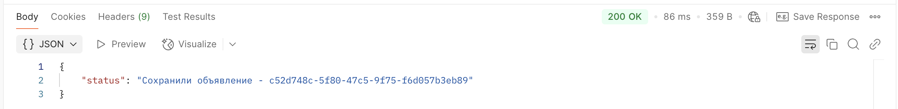
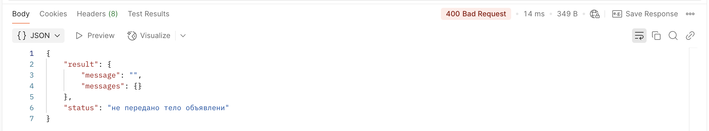
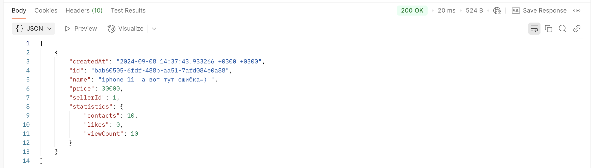
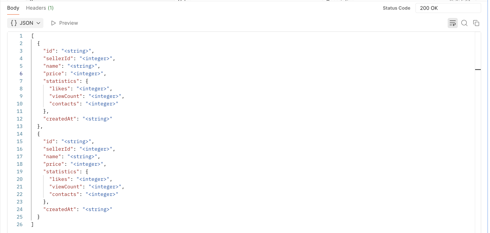
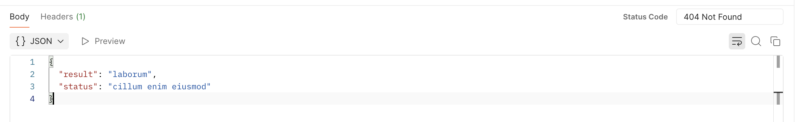
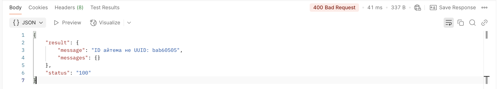
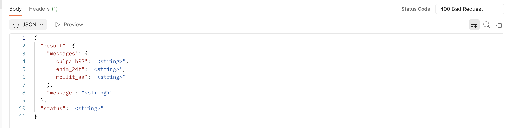
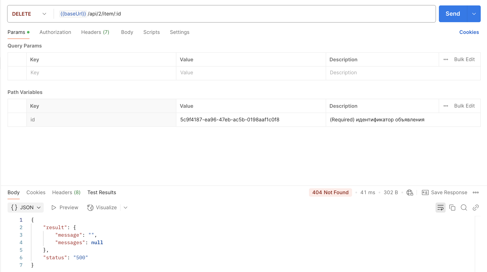
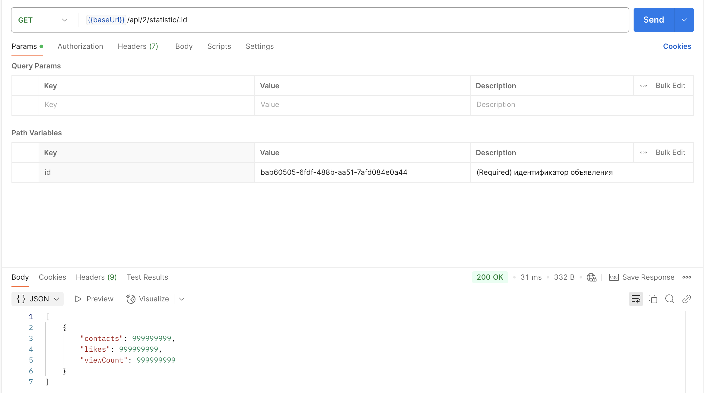
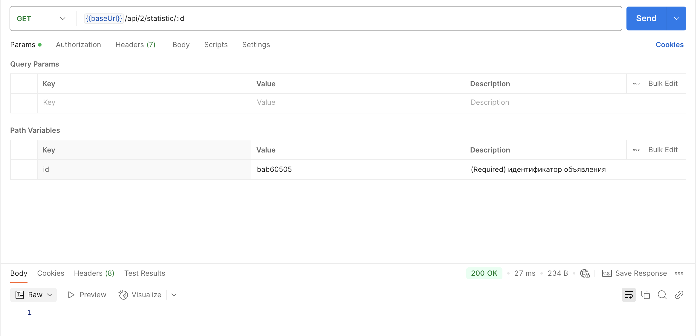

# Bug report для API

## 1. Некорректный ответ сервера при валидном создании объявления

**Приоритет**: High  
**Шаги воспроизведения**:  
  * Отправить POST запрос на адрес https://qa-internship.avito.com/api/1/item, в теле запроса передать объект c **валидным sellerID в диапазоне 111111-999999**:
```
{
    "name": "Тест",
    "price": 1000,
    "sellerId": 135642,
    "statistics": {
        "contacts": 0,
        "likes": 0,
        "viewCount": 0
    }
}
```
**Ожидаемый результат**:

HTTP status code - 200  
Схема тела ответа сервера:

```
{
  "id": "<string>",
  "sellerId": "<integer>",
  "name": "<string>",
  "price": "<integer>",
  "statistics": {
    "likes": "<integer>",
    "viewCount": "<integer>",
    "contacts": "<integer>"
  },
  "createdAt": "<string>"
}
```
**Фактический результат**:

HTTP status code - 200 c невалидным телом ответа сервера:  


## 2. Некорректный ответ сервера при отсутствии обязательных полей при создании объекта

**Приоритет**: High  
**Шаги воспроизведения**:  
  * Отправить POST запрос на адрес https://qa-internship.avito.com/api/1/item, в теле запроса передать по очередно тестовые данные:

* отстутствие sellerId:
```
{
  "name": "тест2",
  "price": 100,
  "statistics": {
    "likes": 0,
    "viewCount": 0,
    "contacts": 0
  }
}
```
* отстутствие name:
```
{
  "sellerId": 123435,
  "price": 100,
  "statistics": {
    "likes": 0,
    "viewCount": 0,
    "contacts": 0
  }
}
```
* отстутствие price:
```
{
  "sellerId": 876402,
  "name": "тест3",
  "statistics": {
    "likes": 0,
    "viewCount": 0,
    "contacts": 0
  }
}
```
* отстутствие statistics:
```
{
  "sellerId": 764890,
  "name": "тест4",
  "price": 100
}
```
* отстутствие двух и более полей:
```
{
  "sellerId": 764378,
}
```
* отстутствие всех полей:
```
{ }
```
* отстутствие одного, нескольких или всех полей в statistics:
```
{
  "sellerId": 764890,
  "name": "тест4",
  "price": 100,
  "statistics": {
    "likes": 0
  }
}
```

**Ожидаемый результат**:

HTTP status code - 400  
Тело ответа сервера:

```
{
  "result": {
    "messages": {
      "culpa_b92": "<string>",
      "enim_24f": "<string>",
      "mollit_aa": "<string>"
    },
    "message": "<string>"
  },
  "status": "<string>"
}
```
**Фактический результат**:

HTTP status code - 200 c телом ответа сервера:  


## 3. Некорректный ответ сервера при некорректных значениях полей при создании объекта

**Приоритет**: High

**Предусловия**: -

**Тестовые данные**:

1. некорректный sellerId (не в диапозоне 111111-999999):
```
{
  "sellerId": 123,
  "name": "тест4",
  "price": 100,
  "statistics": {
    "likes": 0,
    "viewCount": 0,
    "contacts": 0
  }
}
```
2. отрицательное значение price:
```
{
  "sellerId": 123820,
  "name": "тест4",
  "price": -100,
  "statistics": {
    "likes": 0,
    "viewCount": 0,
    "contacts": 0
  }
}
```
3. пустое name:
```
{
  "sellerId": 123820,
  "name": "",
  "price": 100,
  "statistics": {
    "likes": 0,
    "viewCount": 0,
    "contacts": 0
  }
}
```
4. отрицательное значение likes:
```
{
  "sellerId": 123820,
  "name": "тест5",
  "price": 100,
  "statistics": {
    "likes": -2,
    "viewCount": 0,
    "contacts": 0
  }
}
```
5. отрицательное значение viewCount:
```
{
  "sellerId": 123820,
  "name": "тест5",
  "price": 100,
  "statistics": {
    "likes": 0,
    "viewCount": -3,
    "contacts": 0
  }
}
```
6. отрицательное значение contacts:
```
{
  "sellerId": 123820,
  "name": "тест5",
  "price": 100,
  "statistics": {
    "likes": 0,
    "viewCount": 0,
    "contacts": -6
  }
}
```
**Шаги выполнения**:
1. Отправить POST поочередно с одним из типов тестовых данных

**Ожидаемый результат**:

HTTP status code - 400  
Схема тела ответа сервера:

```
{
  "result": {
    "messages": {
      "culpa_b92": "<string>",
      "enim_24f": "<string>",
      "mollit_aa": "<string>"
    },
    "message": "<string>"
  },
  "status": "<string>"
}
```
**Фактический результат**:

HTTP status code - 200 c телом ответа сервера:  


## 4. Некорректный ответ сервера при передаче в поле price значения больше 19 символов при создании объекта

**Приоритет**: High

**Предусловия**: -

**Тестовые данные**:
```
{
  "sellerId": 123820,
  "name": "тест6",
  "price": 10000000000000000000,
  "statistics": {
    "likes": 0,
    "viewCount": 0,
    "contacts": 0
  }
}
```
**Шаги выполнения**:
1. Отправить POST запрос на адрес https://qa-internship.avito.com/api/1/item, в теле запроса передать объект c полем **price** длиной больше 19 символов

**Ожидаемый результат**:

HTTP status code - 400  
Схема тела ответа сервера:

```
{
  "result": {
    "messages": {
      "culpa_b92": "<string>",
      "enim_24f": "<string>",
      "mollit_aa": "<string>"
    },
    "message": "<string>"
  },
  "status": "<string>"
}
```
**Фактический результат**:

HTTP status code - 400
Некорректный тест в поле **status**:  


## 5. Некорректные значения полей в ответе при получении существующего объекта по ID (GET /api/1/item/:id)

**Приоритет**: High

**Предусловия**: Объявление с id = bab60505-6fdf-488b-aa51-7afd084e0a88 существует

**Тестовые данные**: id = bab60505-6fdf-488b-aa51-7afd084e0a88

**Шаги выполнения**:
1. Отправить GET запрос на /api/1/item/bab60505-6fdf-488b-aa51-7afd084e0a88

**Ожидаемый результат**:

HTTP status code - 200  
Tело ответа сервера:

```
{
  "createdAt": "2024-09-08 14:37:43.933266 +0300 +0300",
  "id": "bab60505-6fdf-488b-aa51-7afd084e0a88",
  "name": "iphone 11",
  "price": 1,
  "sellerId": 30000,
  "statistics": {
    "contacts": 10,
    "likes": 0,
    "viewCount": 10
  }
}
```

**Фактический результат**:

HTTP status code - 200
* ответ приходит в виде массива с объектом, должен быть просто объект
* Некорректный тест в поле **name**:  
* Перепутаны местами значения в полях **price** и **sellerId**
* Неверный формат даты UTC в поле **createdAt** (милисекунды - должно быть 3 цифры, а не 6; два раза указана TimeZone)


## 6. Ошибка в спецификации API при получении существующего объекта по ID (GET /api/1/item/:id)

**Приоритет**: High

**Предусловия**: Объявление с id = bab60505-6fdf-488b-aa51-7afd084e0a88 существует

**Тестовые данные**: id = bab60505-6fdf-488b-aa51-7afd084e0a88

**Шаги выполнения**:
1. Отправить GET запрос на /api/1/item/bab60505-6fdf-488b-aa51-7afd084e0a88

**Ожидаемый результат**:

HTTP status code - 200  
Схема Tела ответа сервера:

```
{
  "id": "<string>",
  "sellerId": "<integer>",
  "name": "<string>",
  "price": "<integer>",
  "statistics": {
    "likes": "<integer>",
    "viewCount": "<integer>",
    "contacts": "<integer>"
  },
  "createdAt": "<string>"
}
```

**Фактический результат**:

HTTP status code - 200
Ответ приходит в виде массива с объектом:


## 7. Ошибка в спецификации API при получении несуществующего объекта по ID (GET /api/1/item/:id)

**Приоритет**: High

**Предусловия**: Объявление с id = bab60505-6fdf-488b-aa51-7afd084e0a89 НЕ существует

**Тестовые данные**: id = bab60505-6fdf-488b-aa51-7afd084e0a89

**Шаги выполнения**:
1. Отправить GET запрос на /api/1/item/bab60505-6fdf-488b-aa51-7afd084e0a89

**Ожидаемый результат**:

HTTP status code - 404

Тело ответа сервера:

```
{
  "result": "not found",
  "status": "Нет объекта с данным id"
}
```

**Фактический результат**:

HTTP status code - 404

Ответ приходит с текстом на латыни:


## 8. Некорректный статус код в теле ответа 404 ошибки

**Приоритет**: High

**Предусловия**: -

**Тестовые данные**: id =	bab60505

**Шаги выполнения**:
1. Отправить GET запрос на /api/1/item/bab60505

**Ожидаемый результат**:

HTTP status code - 400
Тело ответа сервера:

```
{
    "result": {
        "message": "ID айтема не UUID: bab60505",
        "messages": {}
    },
    "status": "400"
}
```

**Фактический результат**:

HTTP status code - 400
Значение в поле status = 100:


## 9. Некорректные имена полей в спецификации API при запросе объекта по некорректному ID (GET /api/1/item/:id)

**Приоритет**: High

**Предусловия**: Объявление с некорректным id = bab60505

**Тестовые данные**: id = bab60505

**Шаги выполнения**:
1. Отправить GET запрос на /api/1/item/bab60505

**Ожидаемый результат**:

HTTP status code - 400
Тело ответа сервера содержит поля с осмысленными названиями

**Фактический результат**:

HTTP status code - 400

Поля с именами: culpa_b92, enim_24f, mollit_aa


## 10. Получение некорректных объектов по sellerID (GET /api/1/:sellerID/item)

**Приоритет**: High

**Предусловия**: -

**Тестовые данные**: id = 1

**Шаги выполнения**:
1. Отправить GET запрос на /api/1/1/item

**Ожидаемый результат**:

HTTP status code - 200

Тело ответа сервера содержит массив с объектами, у которых sellerID=1

**Фактический результат**:

HTTP status code - 200

Тело ответа содержит массив с объектами, у которых **price**=1


## 11. Получение некорректной статистики по существующему id

**Приоритет**: High

**Предусловия**: id = bab60505-6fdf-488b-aa51-7afd084e0a88 существует

**Тестовые данные**:

1. id = bab60505-6fdf-488b-aa51-7afd084e0a88

**Шаги выполнения**:
1. Отправить GET запрос на /api/1/statistic/bab60505-6fdf-488b-aa51-7afd084e0a88

**Ожидаемый результат**:

HTTP status code - 200 

Тело ответа сервера:
```
[
  {
    "likes": 0,
    "viewCount": 10,
    "contacts": 10
  }
]
```

**Фактический результат**:

HTTP status code - 200

Поля имеют другие значения


## 12. Некорректный статус код в теле ответа 404 ошибки

**Приоритет**: High

**Предусловия**: id =	5c9f4187-ea96-47eb-ac5b-0198aaf1c0f8 НЕ существует

**Тестовые данные**: id =	5c9f4187-ea96-47eb-ac5b-0198aaf1c0f8

**Шаги выполнения**:
1. Отправить DELETE запрос на /api/2/item/5c9f4187-ea96-47eb-ac5b-0198aaf1c0f8

**Ожидаемый результат**:

HTTP status code - 404
Тело ответа сервера:

```
{
    "result": {
        "message": "ID не найден",
        "messages": {}
    },
    "status": "404"
}
```

**Фактический результат**:

HTTP status code - 404

Значение в поле status = 500:


## 13. Некорректные значения полей при получении статистики существующего объекта по ID (GET /api/2/statistic/:id)

**Приоритет**: High

**Предусловия**: Объявление с id = bab60505-6fdf-488b-aa51-7afd084e0a88 существует

**Тестовые данные**: id = bab60505-6fdf-488b-aa51-7afd084e0a88

**Шаги выполнения**:
1. Отправить GET запрос на /api/1/item/bab60505-6fdf-488b-aa51-7afd084e0a88

**Ожидаемый результат**:

HTTP status code - 200 
Тело ответа сервера:
```
[
  {
    "likes": 0,
    "viewCount": 10,
    "contacts": 10
  }
]
```

**Фактический результат**:

HTTP status code - 200

Поля имеют другие значения


## 13. Некорректные значения полей при получении статистики НЕсуществующего объекта по ID (GET /api/2/statistic/:id)

**Приоритет**: High

**Предусловия**: Объявление с id = bab60505-6fdf-488b-aa51-7afd084e0a44 НЕ существует

**Тестовые данные**: id = bab60505-6fdf-488b-aa51-7afd084e0a44

**Шаги выполнения**:
1. Отправить GET запрос на /api/1/item/bab60505-6fdf-488b-aa51-7afd084e0a44

**Ожидаемый результат**:

HTTP status code - 404 
Тело ответа сервера:
```
{
  "result": "laborum",
  "status": "cillum enim eiusmod"
}
```

**Фактический результат**:

HTTP status code - 200
Поля имеют другие значения


## 14. Некорректные значения полей при получении статистики НЕ валидного объекта по ID (GET /api/2/statistic/:id)

**Приоритет**: High

**Предусловия**: Объявление с id = bab60505 НЕ валидный

**Тестовые данные**: id = bab60505

**Шаги выполнения**:
1. Отправить GET запрос на /api/1/item/bab60505

**Ожидаемый результат**:

HTTP status code - 400  
Тело ответа сервера:

```
{
  "result": {
    "messages": {
      "culpa_b92": "<string>",
      "enim_24f": "<string>",
      "mollit_aa": "<string>"
    },
    "message": "<string>"
  },
  "status": "<string>"
}
```

**Фактический результат**:

HTTP status code - 200

