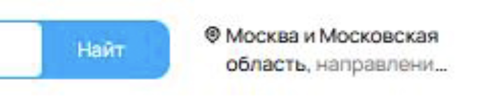
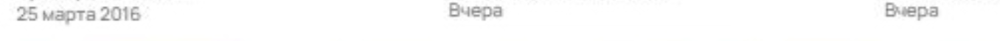
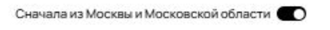
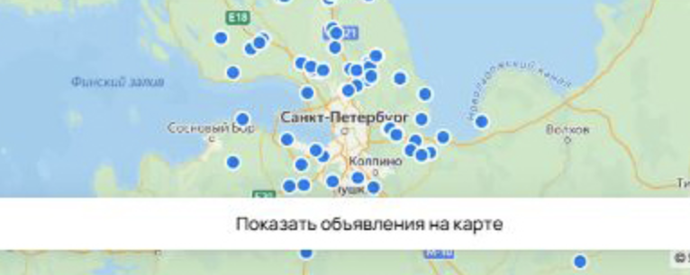
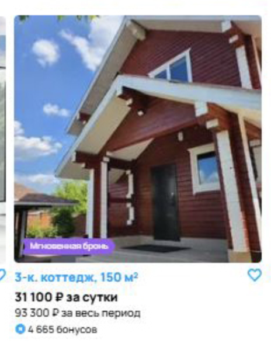
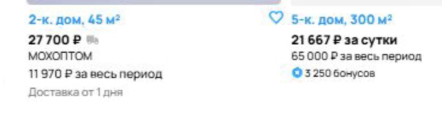
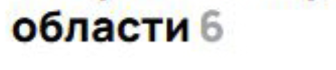
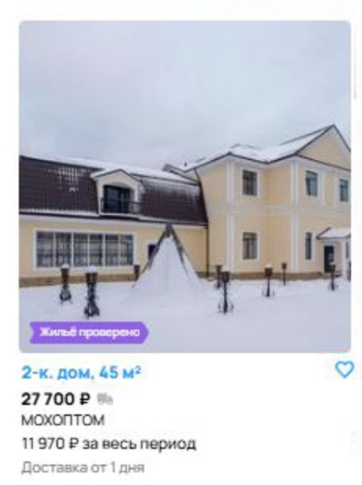
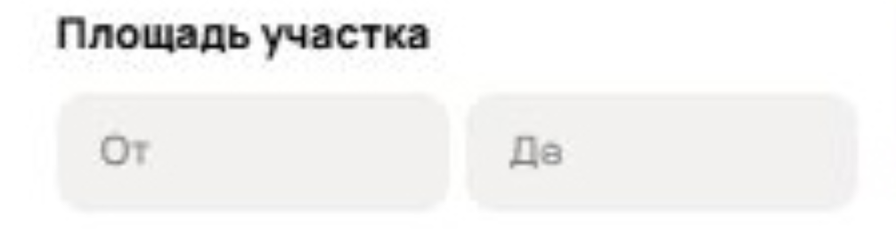
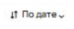

# Баги со скриншота страницы Авито
**Ошибка 1:** Орфографическая ошибка в кнопке "Найти" (отсутствует "и")

**Приоритет**: high (Кнопка перед глазами у пользователей, портит репутацию компании)

___

**Ошибка 2:** Ложное отображение кнопки "Ничего не найдено" при наличии результатов, удовлетворяющих поиску

**приоритет:** high (Вводит в заблуждение пользователя, а это основной функционал сайта)

___

**Ошибка 3:** Несоответствие режима отображения результата поиска (выбрано "Карты", но отображается "Плитка")

**приоритет:** high (Не работает основной функционал поиска)

___

**Ошибка 4:** Сортировка "По дате" не применяется

**приоритет:** high (Основной функционал поиска)

___

**Ошибка 5:** Некорректная геолокация (фильтр "Москва и МО", но показываются результаты из СПб и других регионов)

**приоритет:** high (Основной функционал поиска)

___

**Ошибка 6:** Ошибка в ценообразовании (указано "в месяц" вместо "за сутки"), не соотвтествие с выбранным фильтром

**приоритет:** high (Основной функционал поиска)

___

**Ошибка 7:** Отсутствие ключевых данных в карточках: адрес, дата размещения

**приоритет:** high (Основной функционал поиска)

___

**Ошибка 8:** Неверный расчет общей суммы за выбранный период

**приоритет:** high (Основной функционал поиска)

___

**Ошибка 9:** Неточное количество объявлений в выдаче

**приоритет:** medium (Вводит в заблуждение пользователя, но не влияет на результат)

___

**Ошибка 10:** Ошибочно показанный блок "Ничего не найдено"

**приоритет:** medium (Вводит в заблуждение пользователя, но не влияет на результат)

___

**Ошибка 11:** Нерелевантная информация ("Доставка от 1 дня", "14 дней на возврат")

**приоритет:** medium (Вводит в заблуждение пользователя, но не влияет на результат)

___

**Ошибка 12:** Опечатка в слове "До" в фильтрах

**приоритет:** low (Не сильно заметно пользователю, не влияет на фунционал)

___

**Ошибка 13:** Выводится объявление, не относящееся к выбранной категории (аренда нидвижимости): "Реклама окон"

**приоритет:** low (Пользователь будет игнорировать это объявление)

___

**Ошибка 14:** Смещенная стрелка в сортировке "по дате"

**приоритет:** low (Не сильно заметно, не влияет на фунционал)

